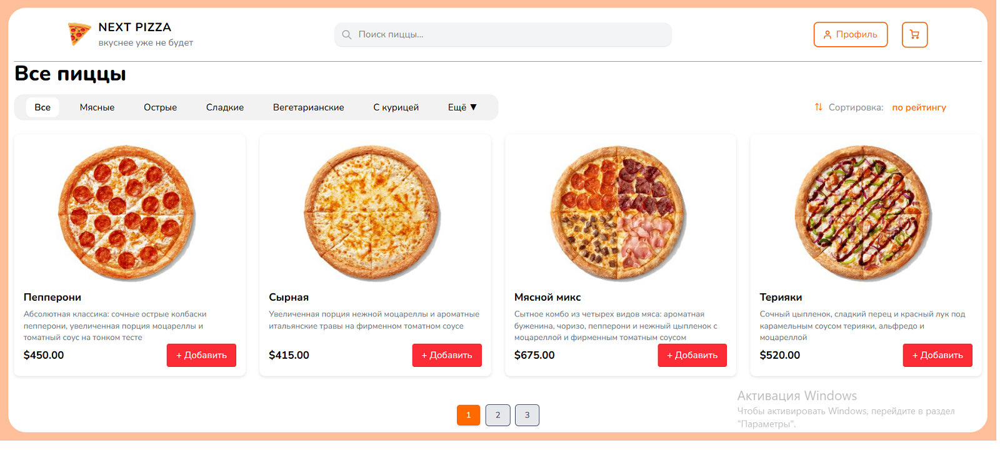

# 🍕 Best Pizza

Modern pizza delivery web application built with Vue 3 and Vite.

## 🚀 Live Demo

🌐 https://georggeo.github.io/best-pizza/

---

## 📌 Features

- 🛒 Shopping cart system
- ❤️ Favorites system
- 🔍 Product search
- 🎯 Product filtering
- 📄 Pagination
- 🔄 Product sorting
- 🔥 Toast notifications
- 🎨 Smooth animations
- 📱 Responsive design
- 💾 Data saving with LocalStorage
- 🪟 Modal windows
- ⚡ Fast Vite build

---

## 🛠️ Technologies Used

### Frontend
- Vue 3
- Composition API
- JavaScript (ES6+)
- Vite

### Libraries
- Vue Router
- Vue Toastification
- Auto Animate

---

## 📷 Screenshots



---

## ⚙️ Installation

Clone repository:

```bash
git clone https://github.com/GeorgGeo/best-pizza.git
```

Install dependencies:

```bash
npm install
```

Run development server:

```bash
npm run dev
```

Build for production:

```bash
npm run build
```

---

## 🧠 What I Practiced In This Project

- Component architecture in Vue 3
- Working with Composition API
- State management with reactive data
- Dynamic rendering
- Pagination logic
- Search and filtering logic
- LocalStorage integration
- GitHub Pages deployment
- UI/UX animations
- Modal window management

---

## 📬 Contact

GitHub: https://github.com/GeorgGeo
